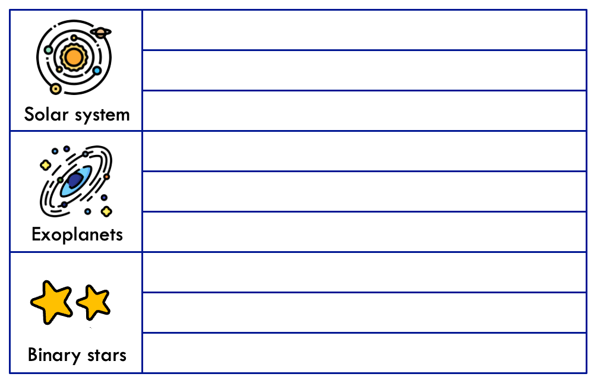
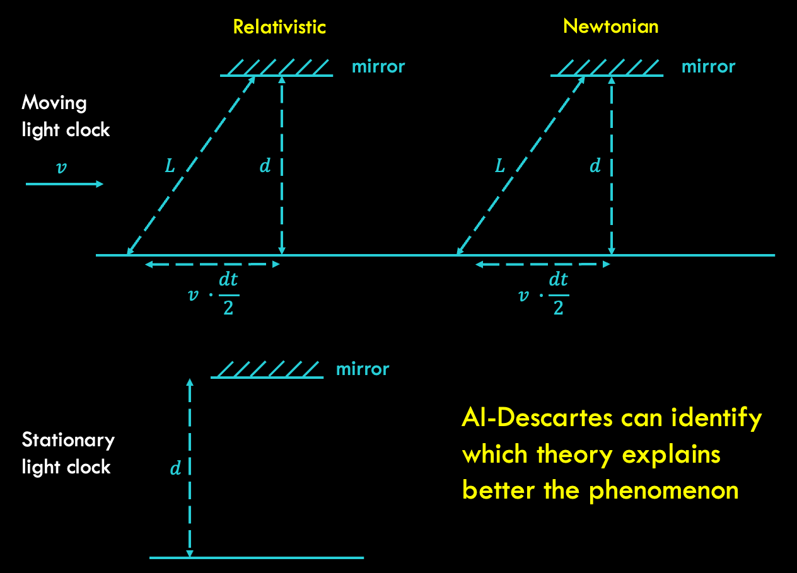

Scientists aim to create mathematical models that can accurately describe an observed phenomenon. There are two common approaches to creating these models: manually creating them based on domain knowledge and fitting them to the data, or using machine learning algorithms to automatically create models from large datasets. However, neither of these approaches is perfect. Finding models from numerical data that are meaningful (consistent with prior knowledge expressed via general logical axioms) is still an open problem. We have developed a method that combines logical reasoning with symbolic regression to enable principled extraction of models of natural phenomena from axiomatic knowledge and experimental data.

 
### AI-Descartes Method
 
Our method combines a reasoning system with a novel symbolic regression (SR) algorithm based on mathematical optimization. SR models are typically more interpretable than neural network (NN) models and require less data. Our end-to-end discovery system extracts formulas from data via SR and then furnishes either a formal proof of derivability of the formula from a set of axioms, or a proof of inconsistency. We also provide novel measures that indicate how close a formula is to the derivable one, when the model is provably non-derivable.
 
 

 
Thus, our method aims to discover an unknown symbolic model where the discovered model should fit a collection of data points, be derivable from (or close to) a background theory, have low complexity, and have bounded prediction error. The inputs to the system are 4-tuples that include background knowledge, data, a hypothesis class, and a set of modeler preferences (e.g. error bounds on accuracy). We demonstrated that the method can discover governing laws from a few data points, and that logical reasoning can be used to distinguish between candidate formulas with similar error on the data.

 
We demonstrated these concepts for Kepler’s third law of planetary motion, Einstein’s relativistic time-dilation law, and Langmuir’s theory of adsorption.
 
### Kepler's Third Law of Planetary Motion

Kepler's third law relates the distance between two celestial bodies and their orbital periods. This law can be expressed as an equation that involves the period, distance, masses, and the gravitational constant. The law can be derived using axioms of a background theory that describes the center of mass, distance between bodies, gravitational force, centrifugal force, force balance, and the period definition. Our goal is to recover Kepler's third law from real measurements of pairs of masses, the distance between them, and their orbital period. The Symbolic Regression (SR) module was used to obtain a set of candidate formulas. The quality of these formulas was evaluated using three logic-based measures: pointwise reasoning error, generalization reasoning error, and variable dependence. The results show that AI-Descartes is able to re-discover the original law using the SR module and that it is able to identify the derivable original law in a set of candidates with similar numerical error. 

### Relativistic Time Dilation

Einstein's theory of relativity postulates that the speed of light is constant, and implies that two observers in relative motion to each other will experience time differently and observe different clock frequencies. This law can be expressed as an equation that involves the clocks’ frequency, their relative speed and the speed of light. This formula was recently confirmed experimentally using high precision atomic clocks. 
 
We were able to generate a set of candidate expressions with the SR module, identifying the one that generalizes best. However, we did not recover this formula from data. 
 
Our system can also help rule out alternative axiom sets, such as one that assumes light behaves like other mechanical objects (Newtonian), and the one that assumes the speed of light to be constant (relativistic). Thus the data is used indirectly to discriminate between axiom systems relevant to the phenomenon under study.

### Langmuir's Adsorption Equation

Langmuir’s equation relates the loading on a surface to the pressure of a gas that contacts the surface. This law can be expressed as an equation that involves the pressure, the loading and constants characterizing the maximum loading and the adsorption strength.
 
We used two sets of experimental data to illustrate how the SR module can obtain the best fitting functions with two and four constants using the operators +, -, ×, and ÷ (where the constants depend on the material, gas, and temperature).
 
We encoded the background theory in a set of axioms which includes the site balance, adsorption rate model, desorption rate model, equilibrium assumption, and mass balance on the loading. Langmuir's equation can be derived from these axioms (with some additional non-negativity constraints). We were able to prove one of the formulas by using existentially quantified variables to represent the constants derived from the data.

### Conclusions and Limitations

One limitation of our system is the assumption of correctness and completeness of the background theory, which could in principle be solved by introducing abductive or probabilistic reasoning. However, the background theories used in our work were generated manually: acquiring axioms for machine-readable format for physics and other natural sciences is currently limited. Another limitation is the scaling behavior of automated theorem provers and symbolic regression tools, which have excessive computational complexity. Finally, our system could benefit from improvements in individual components and by introducing techniques such as experimental design. 
 
In conclusion, in our work we combined logical reasoning with symbolic regression to enable principled derivations of models of natural phenomena from axiomatic knowledge and experimental data. Our method has potential applications in various fields of science, where it could aid in discovering meaningful formulas that accurately describe experimental data while also incorporating prior knowledge expressed as constraints.

## Data and Code
 Data and code can be found, freely available, at our GitHub repository.

